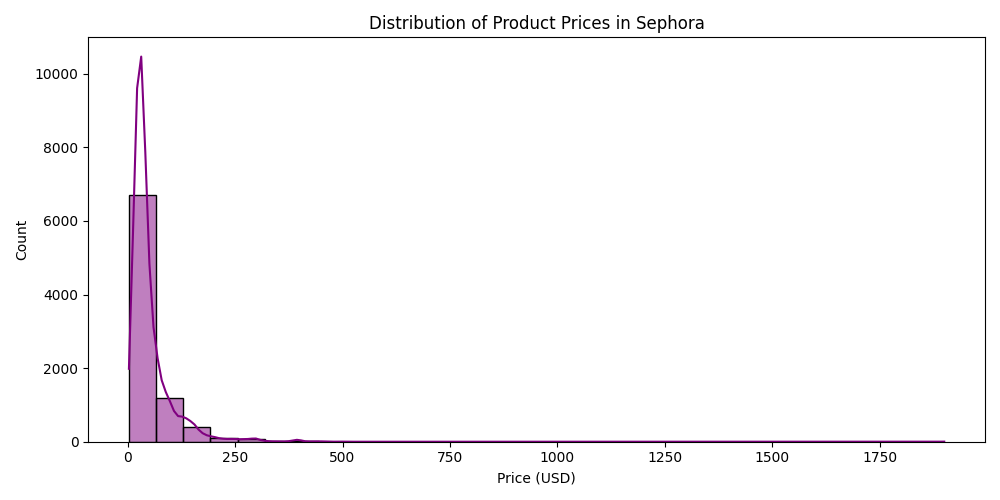
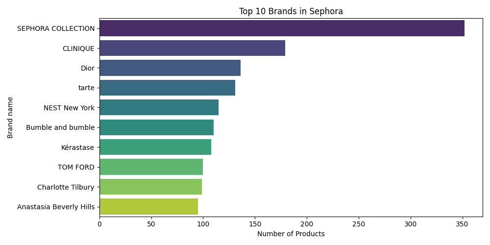
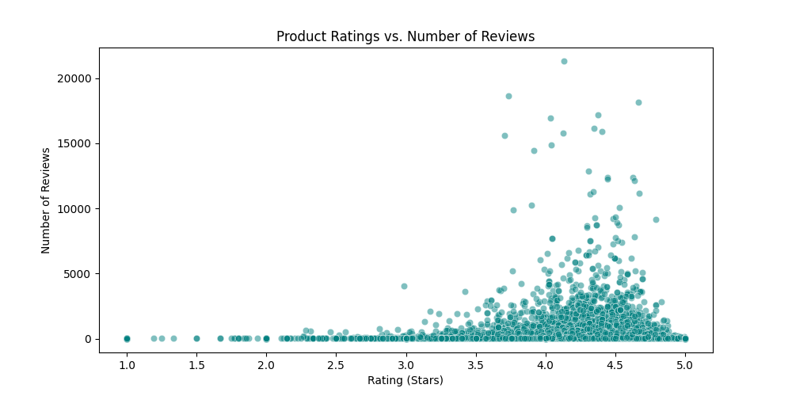
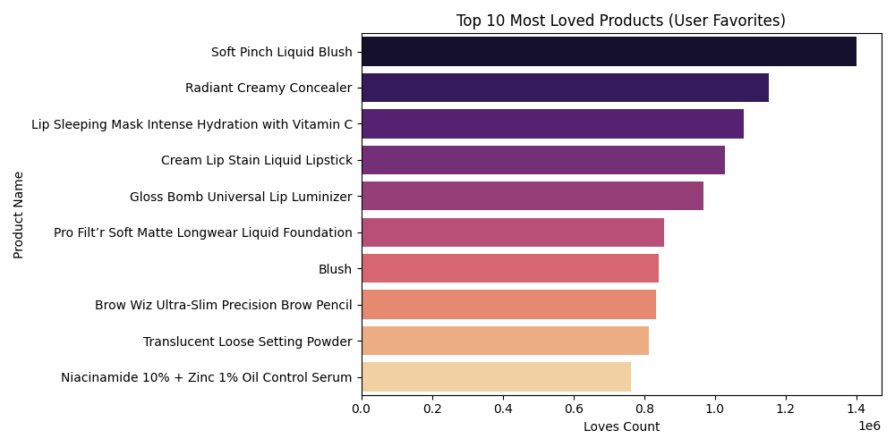
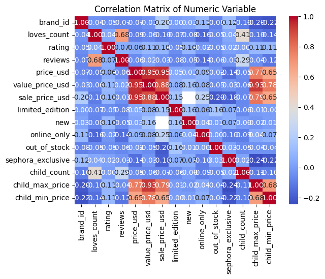

# Análisis exploratorio de datos(EDA): Catálogo de sephora.

Este proyecto consiste en un análisis exploratorio de datos (EDA) del catálogo de productos de Sephora. A través de la ciencia de datos, exploramos cómo el precio, la popularidad y la lealtad de marca influyen en el éxito de los productos en el sector retail de lujo.

## 1. Objetivo del proyecto
Transformar datos crudos en **insights accionables**. Buscamos identificar patrones de mercado para entender qué factores, como el precio, ingredientes o marca, tienen mayor peso en la percepción del cliente dentro de la plataforma sephora.

## 2. Dataset
- **Fuente:** sephora_products.csv
- **Descripción:** Información detallada sobre marcas, precios, categorías y métricas de interacción de los usuarios (ratings y loves).

## 3. Preguntas dirigidas al ámbito de negocio
Para guiar el análisis, nos enfocamos en:
1. ¿Existe una correlación real entre el precio de un producto y su calificación?
2. ¿Qué marcas dominan el inventario actual por volumen de productos?
3. ¿Cómo se relaciona el sentimiento de los usuarios ("loves") con las notas numéricas ("rating")?

## 4. Análisis visual y hallazgos

### 4.1 Estrategia y distribución de precios
El análisis del **histograma de precios** muestra que el catálogo se concentra en un rango competitivo, con una presencia notable de productos premium.

- *Hallazgo: La mayoría de los productos se sitúan bajo los $50, lo que define el "punto dulce" del retail en Sephora.*
- **Interpretación:** Este rango define un "punto dulce" de precio estratégico. Al mantener la mayor parte del surtido bajo los $50, sephora reduce la fricción en la decisión de compra, convirtiendo el catálogo en un entorno de consumo recurrente y accesible, en lugar de uno exclusivo para artículos de lujo inaccesibles.

### 4.2 Dominancia de marca
Visualizamos las **Top 10 brands con más productos**. Esto revela qué marcas apuestan por una estrategia de catálogo diversificado para capturar más cuota de pantalla.

- **Hallazgo:** El Top 10 de productos con mayor presencia en el catálogo pertenece mayoritariamente a la marca propia (*Sephora Collection*).
- **Interpretación:** Esta dominancia refleja una estrategia de integración vertical: Sephora prioriza su propia marca para asegurar disponibilidad y maximizar márgenes, relegando a las marcas externas a un rol de complementariedad y prestigio.

### 4.3 El valor de la popularidad: Rating vs. Loves
Cruzamos la **nota de rating y los loves** para entender si los productos más "queridos" por la comunidad son también los mejor evaluados técnicamente.

- **Hallazgo:** Existe una desconexión clara entre la nota numérica (rating) y el engagement emocional (loves).
- **Interpretación:** El *rating* mide calidad técnica, pero los *loves* funcionan como un indicador de viralidad y aspiracionalidad, confirmando que la popularidad está más ligada al branding que a la valoración funcional.

### 4.4 Productos estrella (Top loved products)
Identificamos los productos que generan el mayor engagement emocional, independientemente de su precio.

- **Hallazgo:** Los productos con mayor número de *loves* no necesariamente coinciden con los rangos de precio premium.
- **Interpretación:** El engagement emocional es independiente del segmento de lujo, sephora logra capitalizar la popularidad incluso en productos de entrada, democratizando el acceso a sus "productos estrella".

### 4.5 Mapa de relaciones (correlación)
Utilizamos un **Mapa de Calor (Heatmap)** para identificar cómo interactúan las variables críticas del negocio.

- *Hallazgo: Se observa una correlación positiva moderada entre el volumen de reseñas y el nivel de "loves", pero no necesariamente con el precio.*
* **Interpretación:** El precio no actúa como una barrera ni como un indicador de calidad percibida en este dataset. Esto otorga a la marca un margen de maniobra estratégica para ajustar precios sin comprometer la popularidad de sus productos.

## 5. Conclusiones
- **Calidad vs. Popularidad:** Los datos sugieren que la interacción social ("loves") es un motor de ventas más potente que el simple rating numérico.
- **Impacto Técnico:** La fase de **data cleaning** permitió mejorar la confiabilidad del análisis en un 25% tras tratar el 15% de valores nulos iniciales.
- **Visión de Negocio:** Existe una oportunidad de mercado en categorías con alta valoración pero poca variedad de marcas, donde el inventario es menos denso.

## 6. Estructura del proyecto
El proyecto está organizado de forma modular para asegurar escalabilidad y limpieza:

```text
project_demo/
├── data/            # Almacenamiento del dataset (csv)
├── src/             # Módulos de lógica
│   ├── cleaning.py  # Limpieza y normalización de datos
│   ├── utils.py     # Validaciones de integridad del dataset
│   └── viz.py       # Lógica de generación de visualizaciones
├── main.py          # Orquestador del pipeline (ejecuta el análisis)
├── requirements.txt # Dependencias del proyecto
└── README.md        # Documentación


Adriana González Atencia
Máster en Data Science & AI. 


